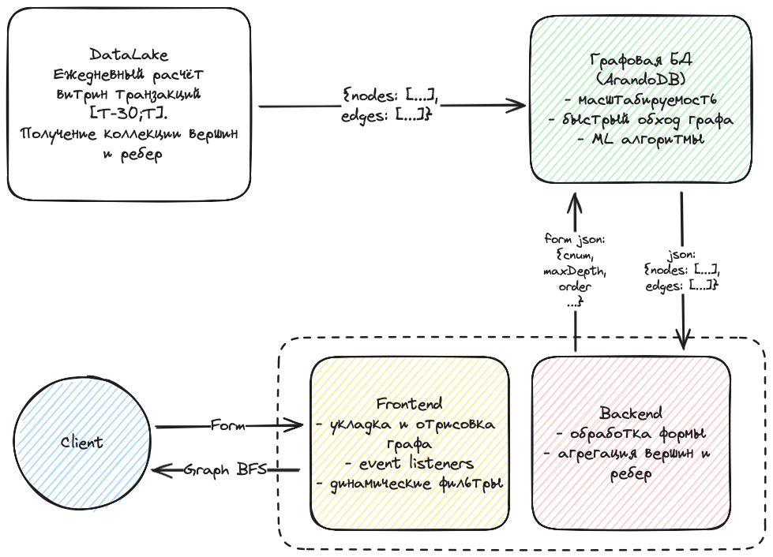

# AML Graph

MVP проект для графовой аналитики в помощь AML сотрудникам банка.

## Цели и предпосылки
- Бизнес-цель - выявление мошеннических схем через UI для графа транзакций и применения
ML алгоритмов на нем.
- Предполагается, что благодаря визуализации аналитик сможет видеть движение средств
в глубину более одного уровня одновременно. Так сократится время на просмотр выписки 
по операциям и появится возможность увидеть полную картину.
- Успехом итерации будем считать применения системы при пост-контроле клиентов, 
находящихся в одном сообществе (у аналитика есть подозрительный клиент, через котрого 
можно выйти на его сообщников).

## Бизнес-требования и ограничения
- Необходима интерактивная работа с графом (фильтры, события на клики).
- Работа с большими объемами данных (порядка 7 млн рублевых переводов в месяц).
- На данной итерации рассматриваться будут только рублевые переводы (есть также
СБП, валютные операции, банкоматы), поскольку непонятно, как сочетать вместе разные каналы.
- Граф для отрисовки должен быть ограничен, например, 1000 вершин, иначе картина будет
слишком нагруженной для визуальной аналитики.
- Для сокращения объема данных нужны фильтры на минимальное значение операций, исключения
крупных компаний, сведение нескольких счетов клиента в одну сущность.
- Успешным пилотом будем считать построение графовой нейронной сети для классификации 
вершин и использовании средств визуализации подграфа для быстрой (по сравнению с текущим 
процессом запроса выписки операций по одному клиенту) проверки со стороны аналитика.
- Один из возможных вариантов развития - это построение эмбеддингов вершин и их 
использование в real-time моделях на контроле операций.

## Архитектура решения

- Ежедневно на кластере производим рассчет витрин с вершинами и ребрами для графа.
Временной период установлен на 30 дней. Для каждого клиента находим данные о его 
дате регистрации, уровне риска, санкциях и других необходимых данных. В качестве ребер 
берем все транзакции (без агрегации за весь период), чтобы в UI дать аналитику возможность
просмотреть всю выписку.
- Переливаем рассчитанные данные в графовую БД, чтобы иметь возможность производить
быстрый обход графа и увеличить скорость доступа к данным.
- Испоьзуем самописный Frontend & Backend, чтобы гибко реализовывать требования заказчика.
На данном этапе - это самый доступный способ визуализации, но его минус в том, что есть
серьезные ограничения в производительности JS при работе с действительно большими графами.